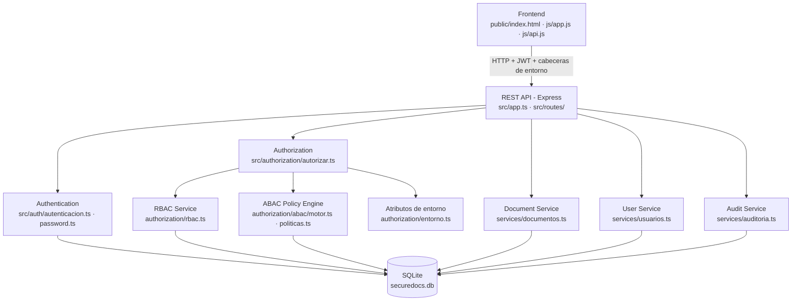
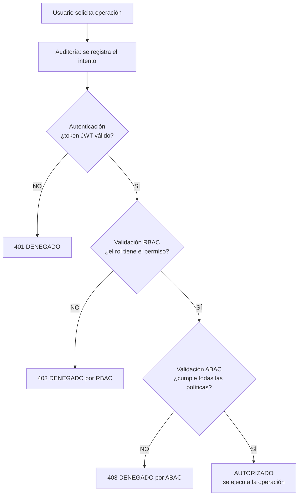

# Diagrama de arquitectura

## Componentes

| Componente | Responsabilidad |
|---|---|
| Frontend | Interfaz web. Envía el token JWT y los atributos de entorno simulados (`x-hora`, `x-ubicacion`, `x-dispositivo`). |
| REST API | Define los endpoints y encadena auditoría → autenticación → autorización → operación. |
| Authentication | Login, emisión y verificación de JWT, cierre de sesión (revocación del token) y hash de contraseñas. |
| Authorization | Ejecuta la evaluación en dos etapas: primero RBAC y luego ABAC. |
| RBAC Service | Obtiene los permisos del rol desde las tablas `Rol`, `Permiso` y `RolPermiso`. |
| ABAC Policy Engine | Lee las políticas activas de la tabla `Politica` y las evalúa con los atributos de usuario, recurso, acción y entorno. |
| Atributos de entorno | Construye hora, fecha, IP, ubicación y dispositivo de la petición. |
| Document / User Service | Consultas de documentos y usuarios. |
| Audit Service | Registra cada intento de acceso con su resultado y motivo. |

## Flujo de autorización

El acceso solo se permite cuando `RBAC = PERMITIDO` y `ABAC = PERMITIDO`.

## Endpoints

| Método | Ruta | Permiso RBAC | Acción ABAC |
|---|---|---|---|
| POST | `/auth/login` | - | LOGIN |
| POST | `/auth/logout` | - | - |
| GET | `/auth/me` | - | - |
| GET | `/usuarios` | gestionar_usuarios | GESTIONAR_USUARIOS |
| POST | `/usuarios` | gestionar_usuarios + asignar_roles | GESTIONAR_USUARIOS |
| PUT | `/usuarios/{id}` | gestionar_usuarios (+ asignar_roles si cambia el rol) | GESTIONAR_USUARIOS |
| GET | `/documentos` | consultar_documento | READ por cada documento |
| GET | `/documentos/{id}` | consultar_documento | READ |
| POST | `/documentos` | crear_documento | CREATE |
| PUT | `/documentos/{id}` | modificar_documento | UPDATE |
| DELETE | `/documentos/{id}` | eliminar_documento | DELETE |
| POST | `/documentos/{id}/aprobar` | aprobar_documento | APPROVE |
| GET | `/auditoria` | ver_auditoria | VER_AUDITORIA |
| GET | `/catalogos` | - | - |
