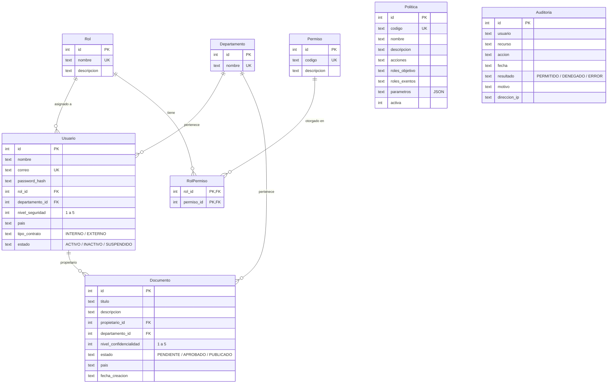

# Modelo de base de datos

Motor: SQLite. El esquema se crea en [src/database.ts](../src/database.ts) y los datos iniciales en [src/seed.ts](../src/seed.ts).

## Entidades

| Entidad | Descripción |
|---|---|
| Rol | Roles del sistema: ADMINISTRADOR, GERENTE, SUPERVISOR, EMPLEADO, AUDITOR, INVITADO. |
| Permiso | Operaciones que se pueden otorgar (crear_documento, consultar_documento, etc.). |
| RolPermiso | Relación muchos a muchos entre roles y permisos. Es la matriz RBAC. |
| Departamento | FINANZAS, RRHH, SISTEMAS. |
| Usuario | Atributos del usuario para ABAC: rol, departamento, nivel de seguridad, país, tipo de contrato y estado. La contraseña se guarda con hash scrypt. |
| Documento | Atributos del recurso para ABAC: departamento, nivel de confidencialidad, estado, país y propietario. |
| Politica | Configuración de las políticas ABAC: a qué acciones aplican, a qué roles, qué roles están exentos, parámetros y si está activa. |
| Auditoria | Registro de cada intento de acceso. `usuario` guarda el correo como texto para poder registrar también intentos anónimos o con credenciales inválidas. |

## Relaciones

- `Usuario` → `Rol` (N:1)
- `Usuario` → `Departamento` (N:1)
- `Rol` ↔ `Permiso` mediante `RolPermiso` (N:M)
- `Documento` → `Departamento` (N:1)
- `Documento` → `Usuario` como propietario (N:1)
